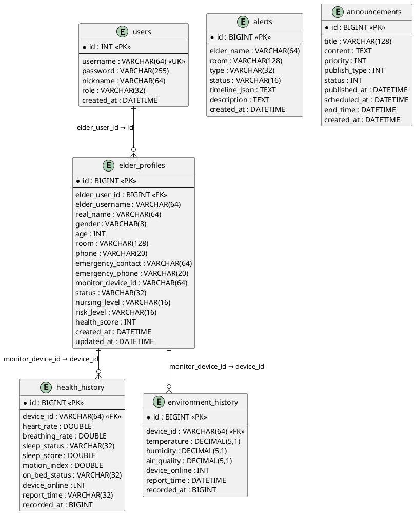
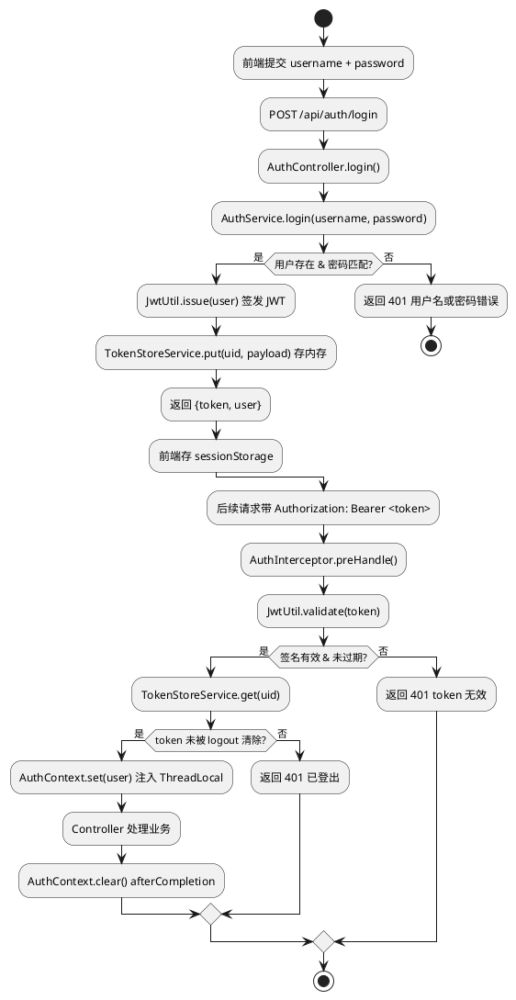
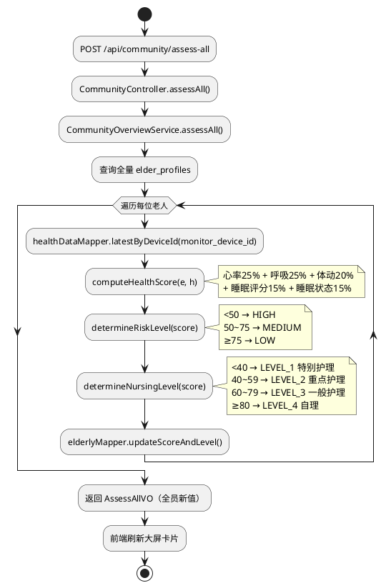
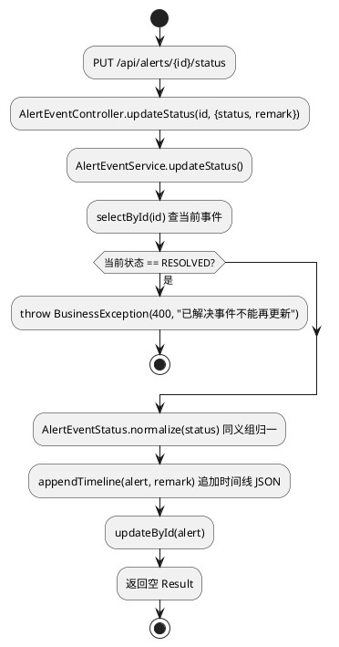

# 社区独居老人健康监护系统 · 系统框架文档

> **课程**：面向对象程序设计 · 课程设计 | **分组**：三人组
> **技术栈**：Spring Boot 2.6.13 + Java 8 + MyBatis-Plus 3.4 + MySQL + Vue 3 + Element Plus + ECharts + JWT

---

## 目录

1. [系统架构概述](#1-系统架构概述)
2. [模块详解](#2-模块详解)
   - [2.1 认证登录（李岩）](#21-认证登录李岩)
   - [2.2 老人档案（李岩）](#22-老人档案李岩)
   - [2.3 个人中心（李岩）](#23-个人中心李岩)
   - [2.4 公共基建（李岩）](#24-公共基建李岩)
   - [2.5 公告管理（王子扬）](#25-公告管理王子扬)
   - [2.6 预警事件（王子扬）](#26-预警事件王子扬)
   - [2.7 Excel 导出（王子扬）](#27-excel-导出王子扬)
   - [2.8 社区概览与一键评估（叶金枝）](#28-社区概览与一键评估叶金枝)
   - [2.9 健康与环境数据（叶金枝）](#29-健康与环境数据叶金枝)
3. [架构设计](#3-架构设计)
4. [类图](#4-类图)
5. [ER 图](#5-er-图)
6. [关键流程图](#6-关键流程图)
7. [接口定义汇总](#7-接口定义汇总)

---

## 1. 系统架构概述

```
┌─────────────────────────────────────────────────────┐
│                    前端（Vue 3）                     │
│  Login │ ElderlyArchive │ Person │ ElderlyMgmt │    │
│  Alerts │ Announcements │ Layout │ Header │ Aside  │
└────────────────────────┬────────────────────────────┘
                         │ axios + JWT Bearer
                         ▼
┌─────────────────────────────────────────────────────┐
│              Spring Boot 2.6（port 9090）            │
│  ┌─────────────────────────────────────────────────┐ │
│  │ Controller 层（9 个 REST 控制器）                │ │
│  ├─────────────────────────────────────────────────┤ │
│  │ Service 层（7 个业务服务）                       │ │
│  ├─────────────────────────────────────────────────┤ │
│  │ Entity 层（6 个实体 + MyBatis-Plus Mapper）     │ │
│  ├─────────────────────────────────────────────────┤ │
│  │ 基建（拦截器 / TokenStore / 全局异常 / 定时任务）│ │
│  └─────────────────────────────────────────────────┘ │
└────────────────────────┬────────────────────────────┘
                         │ JDBC
                         ▼
              ┌─────────────────────┐
              │   MySQL (community)  │
              │ 6 张表 + 初始数据    │
              └─────────────────────┘
```

**三层架构**：Controller（对外 REST API） → Service（业务逻辑） → Mapper（MyBatis-Plus 数据访问）

**认证方案**：JWT 签名 + TokenStore（内存 ConcurrentHashMap）+ AuthInterceptor 统一拦截

---

## 2. 模块详解

### 2.1 认证登录（李岩）

**功能概述**
用户通过用户名/密码登录，后端校验后签发 JWT 返回前端，前端存入 `sessionStorage`。后续请求通过 `Authorization: Bearer <token>` 携带，拦截器统一校验。

**关键类**

| 类                   | 路径                               | 职责                                 |
| ------------------- | -------------------------------- | ---------------------------------- |
| `AuthController`    | `controller/AuthController.java` | 登录/注册/登出 REST API                  |
| `AuthService`       | `auth/AuthService.java`          | 业务校验 + JWT 签发/解析                   |
| `AuthInterceptor`   | `auth/AuthInterceptor.java`      | 拦截器：提取 token → 校验签名 → 查 TokenStore |
| `AuthContext`       | `auth/AuthContext.java`          | ThreadLocal 存储当前登录用户               |
| `TokenStoreService` | `auth/TokenStoreService.java`    | ConcurrentHashMap 内存 Token 存储      |
| `JwtUtil`           | `util/JwtUtil.java`              | JJWT 封装：签发 / 解析 / 过期判断             |
| `UserRole`          | `enums/UserRole.java`            | 角色枚举 + FAMILY 禁止登录校验               |

**核心代码摘录**

```java
// JwtUtil - 签发 JWT（简化，实际含过期时间）
public String issue(User user) {
    long now = System.currentTimeMillis();
    return Jwts.builder()
        .setSubject(user.getUsername())
        .claim("uid", user.getId())
        .claim("role", user.getRole())
        .setIssuedAt(new Date(now))
        .setExpiration(new Date(now + expireMs))
        .signWith(SignatureAlgorithm.HS256, KEY).compact();
}

// AuthInterceptor - 拦截校验
public boolean preHandle(HttpServletRequest req, ...) {
    String token = extract(req);
    if (token == null || !jwtUtil.validate(token)) return false;
    Long uid = jwtUtil.extractUid(token);
    User user = tokenStore.get(uid);
    if (user == null) return false;      // 登出后 token 失效
    AuthContext.set(user);                // 注入 ThreadLocal
    return true;
}

// TokenStoreService - 内存存储（关键：保证登出立即使 token 失效）
private final Map<Long, JwtPayload> STORE = new ConcurrentHashMap<>();
public void put(Long uid, JwtPayload p) { STORE.put(uid, p); }
public void remove(Long uid) { STORE.remove(uid); }
```

**设计要点**

- 拦截器放行 `/api/auth/login` 和 `/api/auth/register`
- `AuthContext` 使用 `ThreadLocal`，请求结束后 `afterCompletion` 清理，防止线程池线程复用时串数据
- FAMILY 角色在 `AuthService.login` 中硬编码拒绝

---

### 2.2 老人档案（李岩）

**功能概述**
社区工作人员管理辖区老人档案（增删改查 + 批量概览），档案含姓名/性别/年龄/房间号/紧急联系人/护理等级/风险等级/健康分。

**关键类**

| 类                      | 路径                                  | 职责                                        |
| ---------------------- | ----------------------------------- | ----------------------------------------- |
| `ElderlyController`    | `controller/ElderlyController.java` | REST API                                  |
| `ElderlyService`       | `service/ElderlyService.java`       | 档案 CRUD 业务                                |
| `ElderlyAccessService` | `service/ElderlyAccessService.java` | 角色隔离查询（admin 全部/community 全部/elder 仅自己关联） |
| `Elderly`              | `entity/Elderly.java`               | `elder_profiles` 实体                       |
| `ElderlyMapper`        | `mapper/ElderlyMapper.java`         | MyBatis-Plus Mapper                       |
| `IdCardUtil`           | `util/IdCardUtil.java`              | 身份证号解析（生日/性别）                             |

**核心代码摘录**

```java
// ElderlyController - 批量概览（大屏首页用）
@GetMapping("/batch-overview")
public Result<List<Map<String, Object>>> batchOverview() {
    List<Elderly> list = elderlyAccessService.listForRole(currentRole());
    return Result.ok(elderlyService.batchOverview(list));
}

// ElderlyAccessService - 角色隔离
public List<Elderly> listForRole(String role) {
    switch (role.toLowerCase()) {
        case "elder": return baseMapper.selectByElderUserId(AuthContext.get().getId());
        default:      return baseMapper.selectList(null);  // admin / community
    }
}
```

---

### 2.3 个人中心（李岩）

**功能概述**
登录用户查询/修改自己的基本信息（昵称、电话等非敏感字段）。

**关键类**

| 类                   | 路径                                  | 职责                           |
| ------------------- | ----------------------------------- | ---------------------------- |
| `ProfileController` | `controller/ProfileController.java` | REST API                     |
| `User`              | `entity/User.java`                  | `users` 实体（密码字段 @JsonIgnore） |

**核心代码摘录**

```java
// ProfileController - 查询当前用户
@GetMapping
public Result<User> profile() {
    User u = AuthContext.get();
    u.setPassword(null);  // 永不返回密码
    return Result.ok(u);
}

// ProfileController - 修改（禁止改 username / role）
@PutMapping
public Result<?> update(@RequestBody User body) {
    User me = AuthContext.get();
    if (body.getUsername() != null || body.getRole() != null) {
        return Result.fail(400, "禁止修改用户名和角色");
    }
    // ... 更新允许字段
}
```

---

### 2.4 公共基建（李岩）

**功能概述**
全项目共用的基础设施层：统一返回包装、全局异常捕获、MyBatis-Plus 配置、Web MVC 拦截器注册、启动类。

**关键类**

| 类                        | 路径                                   | 职责                                                     |
| ------------------------ | ------------------------------------ | ------------------------------------------------------ |
| `DemoApplication`        | 根包                                   | Spring Boot 启动类（含 `@MapperScan` + `@EnableScheduling`） |
| `Result<T>`              | `common/Result.java`                 | 统一响应 `{code, msg, data}`                               |
| `GlobalExceptionHandler` | `common/GlobalExceptionHandler.java` | `@ControllerAdvice` 捕获业务异常                             |
| `MybatisPlusConfig`      | `common/MybatisPlusConfig.java`      | PaginationInnerInterceptor + 表名反引号                     |
| `WebMvcConfig`           | `config/WebMvcConfig.java`           | 注册拦截器 + 放行路径                                           |
| `BusinessException`      | `exception/BusinessException.java`   | 带 code 的业务异常                                           |

**核心代码摘录**

```java
// Result<T> - 统一返回包装
public class Result<T> {
    private int code;
    private String msg;
    private T data;
    public static <T> Result<T> ok(T data) { return new Result<>(200, "ok", data); }
    public static <T> Result<T> fail(int code, String msg) { return new Result<>(code, msg, null); }
}

// GlobalExceptionHandler - 业务异常 → 4xx
@ExceptionHandler(BusinessException.class)
public Result<?> handleBiz(BusinessException e) {
    return Result.fail(e.getCode(), e.getMessage());
}

// WebMvcConfig - 拦截器注册
@Override
public void addInterceptors(InterceptorRegistry registry) {
    registry.addInterceptor(authInterceptor)
        .addPathPatterns("/api/**")
        .excludePathPatterns("/api/auth/login", "/api/auth/register");
}
```

---

### 2.5 公告管理（王子扬）

**功能概述**
管理员/社区创建公告（支持即时发布和预约发布）、分页查询、修改、删除、撤下。定时任务每分钟扫描：预约时间到点自动发布，结束时间到点自动过期。

**关键类**

| 类                           | 路径                                       | 职责                  |
| --------------------------- | ---------------------------------------- | ------------------- |
| `AnnouncementController`    | `controller/AnnouncementController.java` | REST API            |
| `AnnouncementService`       | `service/AnnouncementService.java`       | 业务逻辑 + 状态流转         |
| `Announcement`              | `entity/Announcement.java`               | `announcements` 实体  |
| `AnnouncementMapper`        | `mapper/AnnouncementMapper.java`         | MyBatis-Plus Mapper |
| `AnnouncementScheduledTask` | `task/AnnouncementScheduledTask.java`    | `@Scheduled` 定时扫描   |

**核心代码摘录**

```java
// AnnouncementScheduledTask - 每分钟执行
@Scheduled(fixedRate = 60_000)
public void scan() {
    // 待发布 + 预约时间到 → 已发布
    baseMapper.publishIfScheduled();
    // 已发布 + 结束时间到 → 已过期
    baseMapper.expireIfEndTimePassed();
}

// AnnouncementService - 状态流转
public Announcement publish(Announcement a) {
    if (a.getPublishType() == 1 && a.getScheduledAt() != null) {
        a.setStatus(0);  // 待发布
    } else {
        a.setStatus(1);  // 已发布
        a.setPublishedAt(LocalDateTime.now());
    }
    baseMapper.insert(a);
    return a;
}
```

---

### 2.6 预警事件（王子扬）

**功能概述**
接收 IoT 设备上报的摔倒/一键求助/烟雾/情绪低落事件，分页查询（支持类型/状态/关键词过滤）、单条/批量状态更新、清空已解决、单老人预警统计。

**关键类**

| 类                          | 路径                                     | 职责                                                |
| -------------------------- | -------------------------------------- | ------------------------------------------------- |
| `AlertEventController`     | `controller/AlertEventController.java` | REST API                                          |
| `AlertEventService`        | `service/AlertEventService.java`       | 状态流转 + 同义组归一 + remark→type 匹配守卫                   |
| `AlertEvent`               | `entity/AlertEvent.java`               | `alerts` 实体                                       |
| `AlertEventMapper`         | `mapper/AlertEventMapper.java`         | MyBatis-Plus Mapper                               |
| `AlertEventType`           | `enums/AlertEventType.java`            | 原始枚举 FALL/GAS/SMOKE/SEDENTARY/OTHER（归一化在 Service） |
| `AlertEventStatus`         | `enums/AlertEventStatus.java`          | 原始枚举 NEW/ACK/PROCESSING/CLOSED/FALSE_ALARM        |
| `AlertStatusUpdateRequest` | `dto/AlertStatusUpdateRequest.java`    | 状态更新请求 DTO                                        |

**核心代码摘录**

```java
// AlertEventService - 状态同义组查询映射（前端传"未处理"→DB 匹配 NEW/PENDING/未处理）
private static final Map<String, List<String>> STATUS_MAPPING = new HashMap<>();
static {
    STATUS_MAPPING.put("未处理",   Arrays.asList("NEW", "PENDING", "未处理"));
    STATUS_MAPPING.put("处理中",   Arrays.asList("PROCESSING", "IN_PROGRESS", "处理中"));
    STATUS_MAPPING.put("已解决",   Arrays.asList("RESOLVED", "CLOSED", "ACK", "已解决", "已关闭", "已确认"));
    STATUS_MAPPING.put("误报",     Arrays.asList("FALSE_ALARM", "误报"));
}

// AlertEventService - 英文→中文存储转换（DB 统一存中文）
private static final Map<String, String> STATUS_DISPLAY_TO_DB = new HashMap<>();
static {
    STATUS_DISPLAY_TO_DB.put("NEW",         "未处理");
    STATUS_DISPLAY_TO_DB.put("PROCESSING",  "处理中");
    STATUS_DISPLAY_TO_DB.put("CLOSED",      "已解决");
    STATUS_DISPLAY_TO_DB.put("ACK",         "已解决");
    STATUS_DISPLAY_TO_DB.put("FALSE_ALARM", "误报");
}

// AlertEventService - 状态更新（remark→type 匹配守卫防止错误自动恢复）
@Transactional(rollbackFor = Exception.class)
public void updateStatus(Long id, String status, String remark) {
    AlertEvent existing = alertEventMapper.selectById(id);
    if (existing == null) throw new BusinessException("404", "事件不存在");

    // remark 关键词 → 允许匹配的事件 type/title/description 关键词
    Map<String, String[]> typeGuards = new HashMap<>();
    typeGuards.put("摔倒",   new String[]{"FALL","摔"});
    typeGuards.put("心率",   new String[]{"HEART","心率","心跳"});
    typeGuards.put("环境",   new String[]{"ENV","环境","温度","湿度"});
    // ... 关键词不匹配则跳过本次更新（拦截错误的自动恢复）

    String dbStatus = STATUS_DISPLAY_TO_DB.get(status);
    existing.setStatus(dbStatus != null ? dbStatus : status);
    existing.setRemark(remark);
    alertEventMapper.updateById(existing);
}

// AlertEventService - 类型归一化（将别名归到 5 个大类）
public static String normalizeEventType(String type) {
    if (type == null) return "OTHER";
    String t = type.toUpperCase();
    if (t.contains("FALL") || type.contains("摔倒")) return "FALL";
    if (t.contains("SOS") || t.contains("EMERGENCY") || type.contains("一键求助")) return "EMERGENCY";
    if (t.contains("PRESSURE") || t.contains("EMOTION") || type.contains("情绪")) return "PRESSURE";
    if (t.contains("SMOKE") || t.contains("GAS") || type.contains("烟雾")) return "SMOKE";
    return "OTHER";
}
```

---

### 2.7 Excel 导出（王子扬）

**功能概述**
使用 Apache POI 将预警事件和楼栋汇总报告导出为 `.xlsx`，支持按状态/类型/关键词/楼栋/护理等级/风险等级过滤。

**关键类**

| 类                  | 路径                                 | 职责                |
| ------------------ | ---------------------------------- | ----------------- |
| `ExportController` | `controller/ExportController.java` | REST API + POI 写入 |

**核心代码摘录**

```java
// ExportController - 导出预警 Excel
@GetMapping("/alerts")
public void exportAlerts(@RequestParam(required = false) String status,
                         @RequestParam(required = false) String type,
                         @RequestParam(required = false) String keyword,
                         HttpServletResponse resp) throws Exception {
    List<AlertEvent> list = alertEventService.queryAll(status, type, keyword);

    Workbook wb = new XSSFWorkbook();
    Sheet sheet = wb.createSheet("预警事件");

    // 表头 + 数据行（类型/状态转中文）
    Row header = sheet.createRow(0);
    setCell(header, 0, "事件类型");
    setCell(header, 1, "发生时间");
    setCell(header, 2, "老人姓名");
    // ... 写入每行，AlertEventType.label() / AlertEventStatus.zhName()

    String filename = URLEncoder.encode("预警事件导出.xlsx", "UTF-8");
    resp.setContentType("application/vnd.openxmlformats-officedocument.spreadsheetml.sheet");
    resp.setHeader("Content-Disposition", "attachment; filename=" + filename);
    wb.write(resp.getOutputStream());
    wb.close();
}
```

---

### 2.8 社区概览与一键评估（叶金枝）

**功能概述**
大屏首页统计：老人总数、风险等级分布（HIGH/MEDIUM/LOW）、健康分均值、楼栋分布、在线率。一键重新计算全员健康分 → 风险等级 → 护理等级。

**关键类**

| 类                          | 路径                                      | 职责                |
| -------------------------- | --------------------------------------- | ----------------- |
| `CommunityController`      | `controller/CommunityController.java`   | REST API          |
| `CommunityOverviewService` | `service/CommunityOverviewService.java` | 概览统计 + 健康分计算 + 评估 |
| `CommunityOverviewVO`      | `dto/CommunityOverviewVO.java`          | 概览返回 VO           |
| `AssessAllVO`              | `dto/AssessAllVO.java`                  | 评估返回 VO           |

**核心代码摘录**

```java
// CommunityOverviewService - 健康分计算（5 因子加权）
// CommunityOverviewService - 健康分计算（5 因子区间打分 + 缺测兜底）
// 权重：心率25 + 呼吸25 + 活动20 + 睡眠评分15 + 睡眠状态15，满分100
private static int computeHealthScore(Integer heartRate, Integer breathingRate,
                                       Integer motionIndex, Double sleepScore,
                                       String sleepStatus) {
    double heartScore = heartRate != null ?
        (heartRate >= 51 && heartRate <= 100 ? 25 :
         heartRate >= 41 && heartRate <= 50 || heartRate >= 101 && heartRate <= 110 ? 15 :
         heartRate <= 40 || heartRate >= 111 && heartRate <= 129 ? 5 : 0) : 12;

    double breathScore = breathingRate != null ?
        (breathingRate >= 9 && breathingRate <= 14 ? 25 :
         breathingRate >= 15 && breathingRate <= 20 ? 15 :
         breathingRate < 9 || breathingRate >= 21 && breathingRate <= 29 ? 5 : 0) : 12;

    double motionScore = motionIndex != null ?
        (motionIndex >= 15 && motionIndex <= 35 ? 20 :
         motionIndex >= 8 && motionIndex < 15 || motionIndex > 35 && motionIndex <= 50 ? 15 :
         motionIndex >= 3 && motionIndex < 8 || motionIndex > 50 && motionIndex <= 70 ? 10 : 5) : 10;

    double sleepScoreVal = sleepScore != null ?
        (sleepScore >= 70 ? 15 : sleepScore >= 50 ? 10 : 4) : 7;

    double sleepStatusScore = sleepStatus != null && !sleepStatus.isEmpty() ?
        (sleepStatus.toLowerCase().contains("良好") || s.contains("深睡") ? 15 :
         sleepStatus.toLowerCase().contains("浅") ? 10 :
         sleepStatus.toLowerCase().contains("清醒") ? 7 :
         sleepStatus.toLowerCase().contains("差") || s.contains("异常") ? 5 : 10) : 7;

    return (int) Math.round(heartScore + breathScore + motionScore + sleepScoreVal + sleepStatusScore);
}

// CommunityOverviewService - 一键评估（全员）
public AssessAllVO assessAll() {
    List<Elderly> elders = elderlyMapper.selectList(null);
    List<AssessOne> results = new ArrayList<>();
    for (Elderly e : elders) {
        HealthData h = healthDataMapper.latestByDeviceId(e.getMonitorDeviceId());
        int score = computeHealthScore(
            h != null ? h.getHeartRate() : null,
            h != null ? h.getBreathingRate() : null,
            h != null ? h.getMotionIndex() : null,
            h != null ? h.getSleepScore() : null,
            h != null ? h.getSleepStatus() : null);
        // 风险等级：<50→HIGH, 50~74→MEDIUM, ≥75→LOW
        String risk = score < 50 ? "HIGH" : score < 75 ? "MEDIUM" : "LOW";
        // 护理等级：<40→LEVEL_1, 40~59→LEVEL_2, 60~79→LEVEL_3, ≥80→LEVEL_4
        String level = score < 40 ? "LEVEL_1" :
                       score < 60 ? "LEVEL_2" :
                       score < 80 ? "LEVEL_3" : "LEVEL_4";
        elderlyMapper.updateScoreAndLevel(e.getId(), score, risk, level);
        results.add(new AssessOne(e.getId(), e.getRealName(), score, risk, level));
    }
    return new AssessAllVO(results);
}
```

---

### 2.9 健康与环境数据（叶金枝）

**功能概述**
分页查询老人的健康监测数据（心率/呼吸/睡眠/体动/在床状态）和环境监测数据（温湿度/空气质量），返回固定 24 小时范围内的设备采集记录。

**关键类**

| 类                           | 路径                                          | 职责                       |
| --------------------------- | ------------------------------------------- | ------------------------ |
| `HealthDataController`      | `controller/HealthDataController.java`      | REST API                 |
| `EnvironmentDataController` | `controller/EnvironmentDataController.java` | REST API                 |
| `HealthDataService`         | `service/HealthDataService.java`            | 数据查询 + 模拟画像生成器           |
| `EnvironmentDataService`    | `service/EnvironmentDataService.java`       | 数据查询 + 温湿度尖峰过滤           |
| `HealthData`                | `entity/HealthData.java`                    | `health_history` 实体      |
| `EnvironmentData`           | `entity/EnvironmentData.java`               | `environment_history` 实体 |
| `DateTimeParseUtil`         | `util/DateTimeParseUtil.java`               | 字符串 ↔ LocalDateTime 转换   |

**核心代码摘录**

```java
// HealthDataService - 模拟画像生成器（确定性：同一 elderlyId 同一画像）
public ElderlyHealthProfile buildMockHealthProfile(Long elderlyId) {
    long seed = knuthHash(elderlyId);   // 确定性子
    Random rnd = new Random(seed);
    return ElderlyHealthProfile.builder()
        .heartRate(70 + rnd.nextInt(20))
        .breathingRate(16 + rnd.nextInt(6))
        .healthScore(60 + rnd.nextInt(30))
        .sleepScore(50 + rnd.nextInt(35))
        .sleepStatus(SLEEP_STATUSES[rnd.nextInt(4)])
        .build();
}

// EnvironmentDataService - 尖峰过滤（1.5℃/5% 阈值，保留正常微小波动）
public List<EnvironmentData> fetchWithSpikeFilter(String deviceId) {
    List<EnvironmentData> raw = baseMapper.recent24h(deviceId);
    List<EnvironmentData> filtered = new ArrayList<>();
    EnvironmentData prev = null;
    for (EnvironmentData cur : raw) {
        if (prev != null) {
            double tempDiff = Math.abs(cur.getTemperature() - prev.getTemperature());
            double humDiff  = Math.abs(cur.getHumidity()    - prev.getHumidity());
            if (tempDiff > 1.5 || humDiff > 5.0) continue;  // 跳过异常尖峰
        }
        filtered.add(cur);
        prev = cur;
    }
    return filtered;
}

// DateTimeParseUtil - 字符串 ↔ LocalDateTime 转换
public static LocalDateTime parse(String reportTime) {
    if (reportTime == null) return null;
    DateTimeFormatter fmt = DateTimeFormatter.ofPattern("yyyy-MM-dd HH:mm:ss");
    return LocalDateTime.parse(reportTime, fmt);
}
```

---

## 3. 架构设计

### 后端分层

```
┌─────────────────────────────────────────┐
│         Controller（9 个 REST API）     │  ← 对外接口层
│  AuthController / ElderlyController /   │
│  ProfileController / Announcement /     │
│  AlertEvent / Export / Community /      │
│  HealthData / EnvironmentData           │
├─────────────────────────────────────────┤
│          Service（7 个业务服务）          │  ← 业务逻辑层
│  AuthService / ElderlyService /         │
│  ElderlyAccessService / Announcement /  │
│  AlertEventService / HealthData /       │
│  EnvironmentData / CommunityOverview     │
├─────────────────────────────────────────┤
│    Entity（6 个） + Mapper（MyBatis-Plus）│  ← 数据访问层
│  User / Elderly / HealthData /          │
│  EnvironmentData / AlertEvent /         │
│  Announcement                           │
├─────────────────────────────────────────┤
│        基建（拦截器/异常/定时）           │  ← 横切关注点
│  AuthInterceptor / JwtUtil /            │
│  TokenStore / GlobalException /         │
│  AnnouncementScheduledTask              │
└─────────────────────────────────────────┘
```

### 前端架构

```
┌──────────────────────────────────────────────┐
│                   Vue 3 App                   │
│  ┌──────────────────────────────────────────┐ │
│  │  Router（history 模式 + beforeEach 守卫） │ │
│  ├──────────────────────────────────────────┤ │
│  │  Layout（Header + Aside + Main 三栏布局） │ │
│  ├──────────────────────────────────────────┤ │
│  │  Views（6 个业务页 + 登录注册）           │ │
│  │  Login / Register / Person /              │ │
│  │  ElderlyArchive / ElderlyMgmt /          │ │
│  │  Alerts / Announcements                  │ │
│  ├──────────────────────────────────────────┤ │
│  │  ECharts（双 Y 轴温湿度曲线 + 健康分仪）  │ │
│  │  Element Plus（Table / Dialog / Form）   │ │
│  └──────────────────────────────────────────┘ │
├──────────────────────────────────────────────┤
│  Axios 拦截器（自动加 Bearer / 401 跳登录）  │
└──────────────────────────────────────────────┘
```

---

## 4. 类图

> 图片源文件见 `doc/uml/`，每人一份互不重复。

### 李岩 - 认证/档案/基建类图

```plantuml
@startuml
skinparam classAttributeIconSize 0
package "auth" {
  class AuthController {
    +login(User) Result
    +register(User) Result
    +logout() Result
  }
  class AuthService {
    +login(username, password) User
    +issueToken(User) String
  }
  class AuthInterceptor {
    +preHandle() boolean
    -extractToken() String
  }
  class AuthContext {
    -ThreadLocal<User> CONTEXT
    +set(User)
    +get() User
    +clear()
  }
  class TokenStoreService {
    -ConcurrentHashMap STORE
    +put(uid, payload)
    +get(uid) payload
    +remove(uid)
  }
  class JwtUtil {
    +issue(User) String
    +parse(String) JwtPayload
    +validate(String) boolean
  }
}
package "controller" {
  class ElderlyController { ... }
  class ProfileController { ... }
}
package "service" {
  class ElderlyService { ... }
  class ElderlyAccessService { ... }
}
package "common" {
  class Result<T> { code, msg, data }
  class GlobalExceptionHandler
  class MybatisPlusConfig
}
package "config" {
  class WebMvcConfig
}
package "util" {
  class IdCardUtil
}
package "enums" {
  class UserRole { ADMIN, COMMUNITY, ELDER, CHILD }
}
package "entity" {
  class User
  class Elderly
}
AuthController --> AuthService
AuthService --> JwtUtil
AuthInterceptor --> JwtUtil
AuthInterceptor --> TokenStoreService
AuthInterceptor --> AuthContext
AuthService --> User
ElderlyController --> ElderlyService
ElderlyController --> ElderlyAccessService
ElderlyService --> Elderly
ElderlyAccessService --> Elderly
ProfileController --> AuthContext
WebMvcConfig --> AuthInterceptor
GlobalExceptionHandler --> Result
@enduml
```

### 王子扬 - 公告/导出/预警类图

```plantuml
@startuml
skinparam classAttributeIconSize 0
package "controller" {
  class AnnouncementController { +page +create +update +delete +recall }
  class AlertEventController { +page +updateStatus +batch +clearResolved +getAlertStats }
  class ExportController { +exportAlerts +exportBuildingReport }
}
package "service" {
  class AnnouncementService
  class AlertEventService
}
package "entity" {
  class Announcement
  class AlertEvent
}
package "enums" {
  class AlertEventType { FALL, EMERGENCY, SMOKE, PRESSURE }
  class AlertEventStatus { NEW, PROCESSING, RESOLVED, FALSE_ALARM }
}
package "dto" {
  class AlertStatusUpdateRequest { id, status, remark }
  class BatchStatusUpdateRequest { ids, status, remark }
}
package "task" {
  class AnnouncementScheduledTask { @Scheduled scan() }
}
AnnouncementController --> AnnouncementService
AnnouncementService --> Announcement
AnnouncementScheduledTask --> AnnouncementService
AlertEventController --> AlertEventService
AlertEventService --> AlertEvent
AlertEventService --> AlertEventType
AlertEventService --> AlertEventStatus
ExportController --> AlertEventService
AlertEventController ..> AlertStatusUpdateRequest
AlertEventController ..> BatchStatusUpdateRequest
@enduml
```

### 叶金枝 - 社区/评估/健康环境类图

```plantuml
@startuml
skinparam classAttributeIconSize 0
package "controller" {
  class CommunityController { +overview +assessAll }
  class HealthDataController { +page }
  class EnvironmentDataController { +page }
}
package "service" {
  class CommunityOverviewService { +overview +assessAll +computeHealthScore }
  class HealthDataService { +page +buildMockHealthProfile }
  class EnvironmentDataService { +page +fetchWithSpikeFilter }
}
package "entity" {
  class HealthData
  class EnvironmentData
}
package "dto" {
  class CommunityOverviewVO { totalElders, riskDistribution, avgHealthScore }
  class AssessAllVO { results: List<AssessOne> }
}
package "util" {
  class DateTimeParseUtil { +parse +format }
}
CommunityController --> CommunityOverviewService
CommunityOverviewService --> CommunityOverviewVO
CommunityOverviewService --> AssessAllVO
HealthDataController --> HealthDataService
EnvironmentDataController --> EnvironmentDataService
CommunityOverviewService --> HealthDataService
HealthDataService --> HealthData
EnvironmentDataService --> EnvironmentData
HealthDataService ..> DateTimeParseUtil
EnvironmentDataService ..> DateTimeParseUtil
@enduml
```

---

## 5. ER 图

### 全局 ER 图



**ER 图说明**：

- `elder_profiles.elder_user_id` 关联 `users.id`（仅 elder 角色账号）
- `health_history.device_id` 关联 `elder_profiles.monitor_device_id`（逻辑关联，无外键约束）
- `environment_history.device_id` 同上
- `alerts.elder_name / room` 为**快照冗余字段**，事件发生时记录，不依赖外键（老人档案变更后历史预警不被影响）

---

## 6. 关键流程图

### 登录鉴权流程（李岩）



### 一键评估流程（叶金枝）



### 预警状态更新流程（王子扬）



---

## 7. 接口定义汇总

### 认证 `/api/auth`（李岩）

| 方法   | 路径                   | 负责人 |
| ---- | -------------------- | --- |
| POST | `/api/auth/login`    | 李岩  |
| POST | `/api/auth/register` | 李岩  |
| POST | `/api/auth/logout`   | 李岩  |

### 个人中心 `/api/profile`（李岩）

| 方法  | 路径             | 负责人 |
| --- | -------------- | --- |
| GET | `/api/profile` | 李岩  |
| PUT | `/api/profile` | 李岩  |

### 老人档案 `/api/elderly`（李岩）

| 方法     | 路径                            | 负责人 |
| ------ | ----------------------------- | --- |
| GET    | `/api/elderly/batch-overview` | 李岩  |
| GET    | `/api/elderly/list`           | 李岩  |
| GET    | `/api/elderly/{id}`           | 李岩  |
| POST   | `/api/elderly`                | 李岩  |
| PUT    | `/api/elderly`                | 李岩  |
| DELETE | `/api/elderly/{id}`           | 李岩  |

### 健康数据 `/api/elderly/{elderlyId}/health`（叶金枝）

| 方法  | 路径      | 负责人 |
| --- | ------- | --- |
| GET | `/page` | 叶金枝 |

### 环境数据 `/api/elderly/{elderlyId}/environment`（叶金枝）

| 方法  | 路径      | 负责人 |
| --- | ------- | --- |
| GET | `/page` | 叶金枝 |

### 社区概览 `/api/community`（叶金枝）

| 方法   | 路径            | 负责人 |
| ---- | ------------- | --- |
| GET  | `/overview`   | 叶金枝 |
| POST | `/assess-all` | 叶金枝 |

### 预警事件 `/api/alerts`（王子扬）

| 方法     | 路径                   | 负责人 |
| ------ | -------------------- | --- |
| GET    | `/page`              | 王子扬 |
| PUT    | `/{id}/status`       | 王子扬 |
| PUT    | `/batch`             | 王子扬 |
| DELETE | `/resolved`          | 王子扬 |
| GET    | `/stats/{elderlyId}` | 王子扬 |

### Excel 导出 `/api/export`（王子扬）

| 方法  | 路径                 | 负责人 |
| --- | ------------------ | --- |
| GET | `/alerts`          | 王子扬 |
| GET | `/building-report` | 王子扬 |

### 公告 `/api/announcements`（王子扬）

| 方法     | 路径             | 负责人 |
| ------ | -------------- | --- |
| GET    | `/page`        | 王子扬 |
| POST   | `/`            | 王子扬 |
| PUT    | `/{id}`        | 王子扬 |
| DELETE | `/{id}`        | 王子扬 |
| PUT    | `/{id}/recall` | 王子扬 |

---
